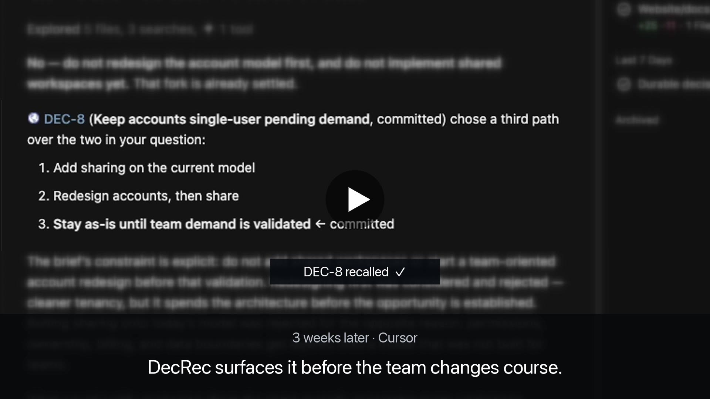

# DecRec

AI explores. You decide. DecRec remembers.

Shared decision memory across Claude, ChatGPT, Cursor, Codex, and other agents.

[](https://decrec.io/#demo)

---

[Install](#install-in-30-seconds) · [Docs](https://decrec.io/docs) · [How it works](#how-it-works) · [Why decisions](#why-decisions-not-everything) · [What the Skill does](#what-the-skill-does) · [What we learned](#what-we-learned-teaching-agents-when-to-remember) · [Privacy](#privacy)

---

## Install in 30 seconds

This package is an [Agent Plugin](https://agent-plugins.org): a skill plus the DecRec MCP server.

### In Cursor

Type this in the chat input as a slash command:

```text
/add-plugin decrec@https://github.com/decrec-io/decrec-plugin
```

Or **Settings → Customize → Plugins** and install from that GitHub repo.

### In Claude Code

```text
/plugin marketplace add decrec-io/decrec-plugin
/plugin install decrec@decrec
```

### In Codex CLI

```text
codex plugin marketplace add decrec-io/decrec-plugin
codex plugin add decrec@decrec
```

[All clients →](#install)

---

## Your agent forgot. DecRec didn't.

### 3 weeks ago — ChatGPT

> Keep accounts single-user until we validate team demand.

✓ Committed as DEC-8

### Today — Cursor, fresh conversation

> Before changing the account model: DEC-8 deliberately kept accounts
> single-user while validating demand. Want to revisit it?

One decision. Any agent.

---

## How it works

MCP gives the agent access to decisions. The Skill teaches it when those decisions matter.

```text
Agent
  ├─ Skill → judgment: when decisions matter
  └─ MCP   → durable decision state
               ↕
             DecRec
```


| Layer      | Role                                                                                |
| ---------- | ----------------------------------------------------------------------------------- |
| **Skill**  | Judgment: what counts as a decision, when to recall, when to capture, when to stop. |
| **MCP**    | Durable state: search, create, update, admit, commit, and archive decisions.        |
| **DecRec** | The shared system of record across chats and agents.                                |


Tools without the skill still write; the skill without tools cannot persist across agents.

---

## Why decisions, not everything?

DecRec remembers decisions, not AI output. Agents can prepare and surface records; a human commits the decision.

Your agent already has access to code, chats, docs, and project context. DecRec doesn't try to remember all of it.

It keeps the smaller set of choices that constrain future work:

- what you chose
- why
- what you considered
- who committed it
- what would justify revisiting it

> The goal isn't more context. It's giving a fresh agent the reasoning behind decisions already made.

---

## What the Skill does

- **Stay in scope** — don't advance past what was asked (no catalog → shape → update → explore → admit → commit chain unless requested).

- **Recall** — search only at a decision boundary (consequential choice that constrains later work). Never before ordinary coding.

- **Capture** — offer once when a consequential fork settles; never auto-create; never interrupt trivia.

- **Humans commit** — the agent can prepare and surface records, but it does not place commitments.

Full protocol: [`skills/decrec/SKILL.md`](skills/decrec/SKILL.md). Exploration prompts: [`skills/decrec/explore-prompts.md`](skills/decrec/explore-prompts.md).

### Try it

After install, allow the MCP connection, then paste one of these into a new conversation:

#### Live choice

```text
Should we [option A] or [option B]?

Work through it from more than one side, then record the decision in DecRec.
```

Or substitute any real decision you're working through.

#### A thread

```text
Here is a [Slack thread / meeting notes]. What is worth recording in DecRec? Don't record until I pick.

[paste]
```

#### Already picked

```text
We picked [option A] over [option B]. Record that decision in DecRec.
```

---

## Install

| Client                                              | Start here                                         |
| --------------------------------------------------- | -------------------------------------------------- |
| [Cursor](#cursor)                                   | Slash command below, or Settings → Plugins         |
| [Claude Code](#claude-code)                         | `/plugin marketplace add`                          |
| [Codex CLI](#codex-cli)                             | `codex plugin marketplace add`                     |
| [Claude (Web and Desktop)](#claude-web-and-desktop) | Add marketplace `decrec-io/decrec-plugin`          |
| [ChatGPT](#chatgpt)                                 | Work: marketplace plugin. Chat: MCP + skill zip    |
| [VS Code](#vs-code)                                 | Command Palette → Chat: Install Plugin From Source |
| [Other](#other)                                     | Copy skill files + MCP connector                   |

### Cursor

Type this in the chat input as a slash command:

```text
/add-plugin decrec@https://github.com/decrec-io/decrec-plugin
```

Or **Settings → Customize → Plugins** and install from that GitHub repo.

### Claude Code

```text
/plugin marketplace add decrec-io/decrec-plugin
/plugin install decrec@decrec
```

### Codex CLI

```text
codex plugin marketplace add decrec-io/decrec-plugin
codex plugin add decrec@decrec
```

### Claude (Web and Desktop)

Same path on both. Skill and MCP come with the plugin.

1. **Customize** → **Plugins** → **Add** → **Add marketplace**
2. URL: `decrec-io/decrec-plugin`
3. **Sync** → select **DecRec** → **Install**
4. Allow when asked.

### ChatGPT

#### Desktop (Work)

Marketplace plugin. Does not run in **Chat**.

1. Open **Plugins** → **Add** → **Add a marketplace**.
2. Source: `decrec-io/decrec-plugin`
3. **Add marketplace**, then install **decrec**.
4. Allow when asked. Start a **new Work** conversation.

#### Web and Desktop (Chat)

Marketplace plugin does not run here. Add MCP and the skill on [chatgpt.com](https://chatgpt.com).

**MCP** (tools only — no skill):

1. **Plugins** → **+**
2. Connection: **Server URL**
3. URL: `https://decrec.io/mcp`
4. **Create**. Allow when asked. Start a **new** conversation.

**Skill:**

1. Download ZIP from the [GitHub repo](https://github.com/decrec-io/decrec-plugin/archive/refs/heads/main.zip)
2. **Plugins** → **Skills** → **+** → upload that zip

### VS Code

Command Palette (`Cmd+Shift+P` / `Ctrl+Shift+P`), then:

```text
Chat: Install Plugin From Source
```

Paste the GitHub URL and press Enter:

```text
https://github.com/decrec-io/decrec-plugin
```

### Other

Copy [`skills/decrec/*.md`](https://github.com/decrec-io/decrec-plugin/tree/main/skills/decrec) (`SKILL.md` and `explore-prompts.md`) into your client's skill directory. Add an MCP connector to `https://decrec.io/mcp`.

---

## What we learned teaching agents when to remember

Useful even if you never use DecRec. Steal these for your own agent skills.

### 1. Capture only when all three hold

Alternatives (≥2 paths), consequence (constrains later work), future relevance (someone will ask *why*).

### 2. Don't advance past the ask

Match the stage they requested; stop there.

### 3. Recall only at a decision boundary

Not before ordinary coding, bugfixes, or implementing an already-chosen approach.

### 4. Fail-fast and branch on error codes

`locked`, `in_flight`, and `pin_mismatch` mean stop (or reload). Don't infer from the chat and retry.

### 5. Isolated role passes

Explore from clean contexts; the agent synthesizes options, the agent does not commit.

### 6. No invented facts

Don't invent stack, vendors, tenancy, or business metrics the brief doesn't state.

See [`skills/decrec/SKILL.md`](skills/decrec/SKILL.md) for the full rules.

---

## Privacy

This plugin connects to the remote MCP server at `https://decrec.io/mcp` (OAuth). DecRec stores account email, organization membership, and decision content you choose to record. Details: [Terms & data policy](https://decrec.io/legal#data). Support: [hello@decrec.io](mailto:hello@decrec.io).
